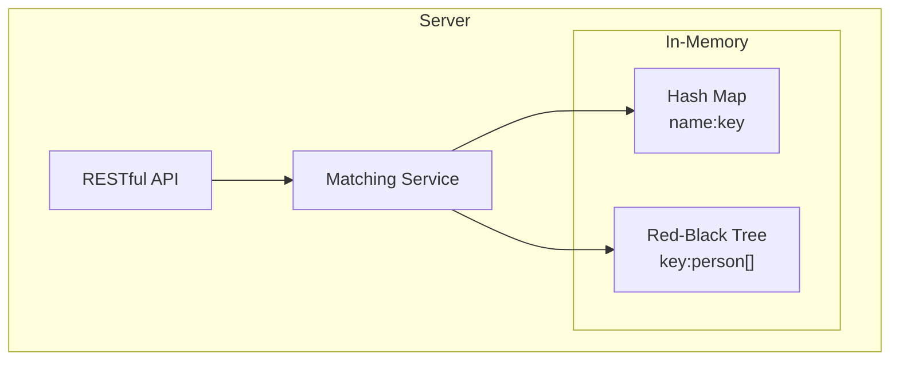

# tinder-match

## Description
HTTP server for the Tinder matching system. The HTTP server must support the following three APIs:
1. AddSinglePersonAndMatch : Add a new user to the matching system and find any possible matches for the new user.
2. RemoveSinglePerson : Remove a user from the matching system so that the user cannot be matched anymore.
3. QuerySinglePeople : Find the most N possible matched single people, where N is a request parameter.

Here is the matching rule:
- A single person has four input parameters: name, height, gender, and number of
wanted dates.
- Boys can only match girls who have lower height. Conversely, girls match boys who
are taller.
- Once the girl and boy match, they both use up one date. When their number of dates
becomes zero, they should be removed from the matching system.


## Setup and Run
### with go
```
# compile and run
$ make run-bin
```

### with docker
```
# build image and run
$ make run-docker
```

## System Design
### Architecture


* **RESTful API**: The server exposes RESTful API for the client to interact with the matching system.
* **Matching Service**: The service layer is responsible for handling the business logic of the matching rule.
* **Hash Map**: The Hash Map is used to store `person.Name` to `person.Key` mapping for quick access.
* **Red-Black Tree**k: The Red-Black Tree is used to store person metadata for matching. The tree is sorted by person.Height.

### Algorithm
As Red-Black Tree is self-balancing binary search tree,
it provides O(log n) time complexity for search, insert, and delete operations.
The tree is sorted by person.Height, so we can find the possible match by searching the tree with the `Height` efficiency.

In the matching service, we use the following algorithm to store and match the person:

About `perons.Key()`:    
if the `person.Gender` is `male`, we store the person in the tree with the `Height` as the key.    
if the `person.Gender` is `female`, we store with the **negative** `Height` as the key.    

With the matching rule:     
"boys can only match girls who have lower height"

This design make the matching become to:    
- search the first node that larger then negative of `Person.Height`    

which is the same as:    
- `person.Key() + matchCandidate.Key() > 0`

But this design has a limitation
that system can **not support negative height** person witch is not a real case.

#### * AddSinglePersonAndMatch:
Add a new user to the matching system and find any possible matches for the new user.
- Match the person with the possible candidate by the matching rule.
- If the person has matched, decrease the wanted dates of the person and the matched candidate.
- If the person has more than 0 wanted dates, add the person to RBtree and hashmap.
- Return the matched candidates.

#### * RemoveSinglePerson:
Remove a user from the matching system so that the user cannot be matched anymore.
- Remove the person from the store both in RBtree and hashmap.

#### * QuerySinglePeople:
Find the most N possible matched single people, where N is a request parameter.
if the "possible matched" means new person came in and the person can be matched with the new person.
- Find largest key from the RBtree (highest male)
- Find the largest key from the RBtree that < 0 (shortest female)
- Find just smaller key from the RBtree for the above two
- repeat the above steps until we get N people

Some other meaning of "possible matched" should be considered:
- in the existing system, the person can be matched with other people
- in large matched scenario, system only left tell female and short male,
so the possible matched may be between them.


### Complexity Analysis
#### * AddSinglePersonAndMatch:
- Time Complexity: O(m + log n)
- m is the number of matched candidates
- n is the number of people in the system

#### * RemoveSinglePerson:
- Time Complexity: O(log n)

#### * QuerySinglePeople:
- Time Complexity: O(m + log n)
- m is number of people to query
- n is the number of people in the system 


## file structure
```
├── cmd
│   └── server      # server entry point
├── docs
│   └── api         # API documentation
├── internal        # sub-folder no need to export
│   ├── config      # config package
│   ├── controller  # controller/handler package
│   │   └── dto     # controller data transfer object
│   ├── http        # gin engine for http 
│   ├── logger      # logger package
│   ├── route       # route path register package
│   ├── server      # app entry point
│   └── service     # service business logic package
├── k6              # k6 load test script
└── model           # entity model able to export
```

## API Documentation
for more detail, you can
find the API documentation in [`docs/api`](https://github.com/jynychen/tinder-match/tree/main/docs/api) folder

* AddSinglePersonAndMatch
    - add a new user and find any possible matches
    - POST /api/v1/people
    - Request
    ```
    {
        "name": "string",
        "height": 0,
        "gender": "string",
        "wantedDates": 0
    }
    ```
    - Response
    ```
    {
       "matched": [ ... ]
    }
    ```

* RemoveSinglePerson
    - Remove a user from the matching system
    - DELETE /api/v1/people/:id

* QuerySinglePeople
    -  Query a list of users from the matching system
    - GET /api/v1/people?limit=0
    - Response
    ```
    {
        "people": [ ... ]
    }
    ```


## TBD/TODO
- [ ] event driven archt. with mq/channel for async processing
- [ ] add user first and matching later for API quick response
- [ ] lock free data structure for concurrent access
- [ ] refactor red black tree to support same key nodes
- [ ] log matching process for validation and failover recovery
- [ ] persist data store for data recovery
- [ ] add unit test / mock for service
- [ ] add integration test for API
- [ ] level log for different log level
- [ ] debug/release build


## Done
- [x] AddSinglePersonAndMatch
- [x] RemoveSinglePerson
- [x] QuerySinglePeople
- [x] unit test for matching service
- [x] matching service test coverage 98.8%
- [x] golangci-lint pass
- [x] k6 load test script
- [x] containerize with docker
- [x] API documentation


## k6 test result
```
$ k6 run k6/match.js

          /\      |‾‾| /‾‾/   /‾‾/   
     /\  /  \     |  |/  /   /  /    
    /  \/    \    |     (   /   ‾‾\  
   /          \   |  |\  \ |  (‾)  | 
  / __________ \  |__| \__\ \_____/ .io

     execution: local
        script: k6/match.js
        output: -

     scenarios: (100.00%) 1 scenario, 10000 max VUs, 1m10s max duration (incl. graceful stop):
              * default: Up to 10000 looping VUs for 40s over 3 stages (gracefulRampDown: 30s, gracefulStop: 30s)


     ✓ is status 200

     checks.........................: 100.00% ✓ 1202716      ✗ 0      
     data_received..................: 526 MB  13 MB/s
     data_sent......................: 419 MB  10 MB/s
     http_req_blocked...............: avg=5.07µs  min=234ns   med=857ns    max=61.86ms  p(90)=2.07µs  p(95)=2.9µs  
     http_req_connecting............: avg=2.96µs  min=0s      med=0s       max=51.06ms  p(90)=0s      p(95)=0s     
     http_req_duration..............: avg=1.33ms  min=18.4µs  med=103.26µs max=109.45ms p(90)=3.64ms  p(95)=7.96ms 
       { expected_response:true }...: avg=1.33ms  min=18.4µs  med=103.26µs max=109.45ms p(90)=3.64ms  p(95)=7.96ms 
     http_req_failed................: 0.00%   ✓ 0            ✗ 2104753
     http_req_receiving.............: avg=29.32µs min=2.88µs  med=10.44µs  max=71.78ms  p(90)=20.91µs p(95)=26.86µs
     http_req_sending...............: avg=30.32µs min=1.25µs  med=4.38µs   max=93.31ms  p(90)=10.03µs p(95)=15.2µs 
     http_req_tls_handshaking.......: avg=0s      min=0s      med=0s       max=0s       p(90)=0s      p(95)=0s     
     http_req_waiting...............: avg=1.27ms  min=11.69µs med=85µs     max=78.11ms  p(90)=3.49ms  p(95)=7.7ms  
     http_reqs......................: 2104753 51541.292945/s
     iteration_duration.............: avg=1.01s   min=1s      med=1s       max=1.35s    p(90)=1.04s   p(95)=1.08s  
     iterations.....................: 300679  7363.041849/s
     vus............................: 43      min=43         max=10000
     vus_max........................: 10000   min=10000      max=10000


running (0m40.8s), 00000/10000 VUs, 300679 complete and 0 interrupted iterations
default ✓ [======================================] 00000/10000 VUs  40s
```